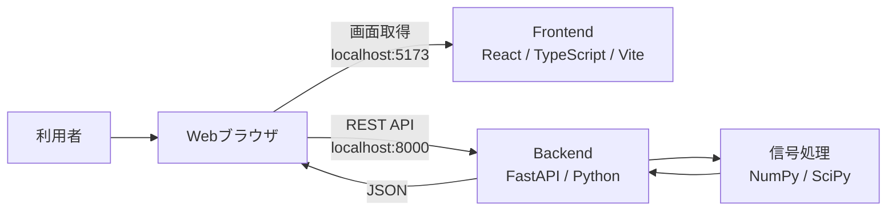
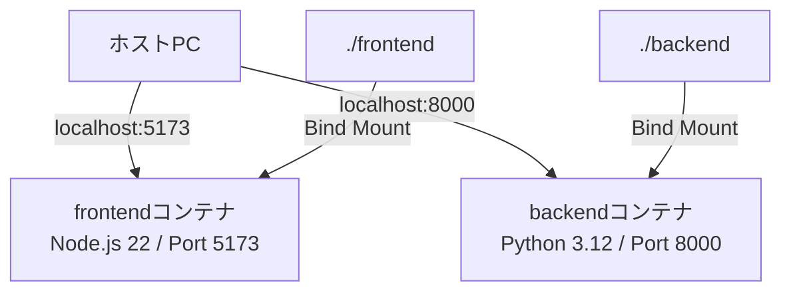
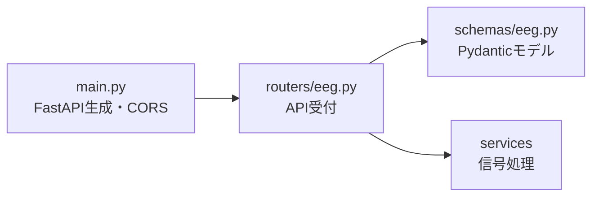
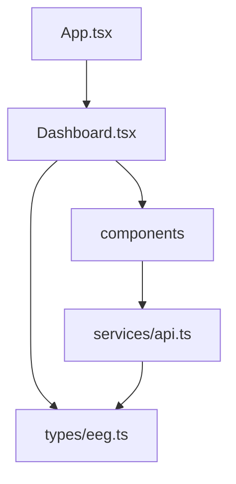
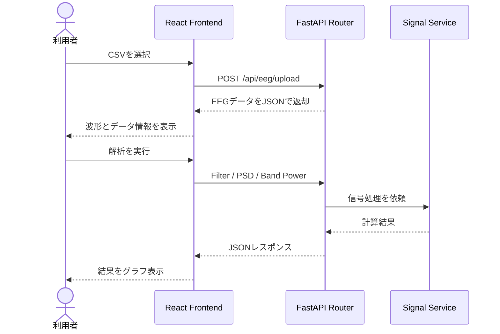

# システム構成

## 目次

- [1. 本文書の目的](#1-本文書の目的)
- [2. システム全体構成](#2-システム全体構成)
- [3. 各構成要素の役割](#3-各構成要素の役割)
  - [3.1 Webブラウザ](#31-webブラウザ)
  - [3.2 Frontend](#32-frontend)
  - [3.3 Backend](#33-backend)
  - [3.4 信号処理](#34-信号処理)
- [4. Docker構成](#4-docker構成)
- [5. 通信経路](#5-通信経路)
  - [5.1 ブラウザからFrontendへのアクセス](#51-ブラウザからfrontendへのアクセス)
  - [5.2 ブラウザからBackendへのアクセス](#52-ブラウザからbackendへのアクセス)
  - [5.3 CORS設定](#53-cors設定)
- [6. Backend内部構成](#6-backend内部構成)
- [7. Frontend内部構成](#7-frontend内部構成)
- [8. 主要な処理の流れ](#8-主要な処理の流れ)
- [9. ディレクトリ構成](#9-ディレクトリ構成)
- [10. 開発時の動作](#10-開発時の動作)
- [11. 現在の構成上の制約](#11-現在の構成上の制約)
- [12. Azure公開時の変更点](#12-azure公開時の変更点)

## 1. 本文書の目的

本文書では、EEG Analysis Platformを構成するFrontend、Backend、信号処理モジュールおよびDockerの関係を示す。

個別APIの入出力は[04_API仕様.md](./04_API仕様.md)、信号処理の詳細は[05_EEG信号処理.md](./05_EEG信号処理.md)に記載する。

## 2. システム全体構成

現在のシステムは、利用者のWebブラウザ、React Frontend、FastAPI BackendおよびSciPyを使用した信号処理モジュールから構成される。



FrontendとBackendはDocker Composeにより別々のコンテナとして起動する。ただし、APIを呼び出すのはFrontendコンテナではなく、FrontendのJavaScriptを実行している利用者のWebブラウザである。

## 3. 各構成要素の役割

### 3.1 Webブラウザ

Webブラウザは、Frontendから配信されたReactアプリケーションを実行する。

- 利用者の操作を受け付ける
- CSVファイルをBackendへ送信する
- Backendから受け取ったJSONをFrontendの状態として保持する
- EEG波形、PSDおよびBand Powerを描画する
- Original信号とFiltered信号を切り替える

### 3.2 Frontend

FrontendはReactとTypeScriptで実装され、Viteの開発サーバーから配信される。

- 画面レイアウトとUIコンポーネントの表示
- CSVファイル選択
- REST APIの呼び出し
- OriginalデータとFilteredデータの状態管理
- APIレスポンスのグラフ表示
- Backendのヘルスチェック

FrontendはEEGのフィルタやPSDを計算せず、解析処理をBackendへ依頼する。

### 3.3 Backend

BackendはPythonとFastAPIで実装され、Uvicornにより起動する。

- REST APIの提供
- CSV形式と内容の検証
- サンプリング周波数と記録時間の算出
- リクエストおよびレスポンスの型検証
- 信号処理サービスの呼び出し
- エラー時のHTTPレスポンス返却

### 3.4 信号処理

信号処理はBackend内のサービスとして実装されている。

| モジュール | 主な役割 |
|---|---|
| `eeg_filter.py` | High-pass、Low-pass、Band-pass、Notchフィルタ |
| `eeg_spectral.py` | Welch法によるPSDとBand Powerの計算 |
| NumPy | EEGデータの二次元配列処理 |
| SciPy | デジタルフィルタ、Welch法、数値積分 |

MNE-Pythonは依存関係に含まれているが、現在の主要な信号処理では使用していない。

## 4. Docker構成

`compose.yaml`では、FrontendとBackendを別々のサービスとして定義している。



| サービス | ベースイメージ | コンテナ内ポート | ホスト側ポート | 起動コマンド |
|---|---|---:|---:|---|
| Frontend | `node:22-alpine` | 5173 | 5173 | `npm run dev -- --host 0.0.0.0` |
| Backend | `python:3.12-slim` | 8000 | 8000 | `uvicorn app.main:app --host 0.0.0.0 --port 8000 --reload` |

ソースディレクトリをコンテナの`/app`へマウントしているため、ローカルで編集した内容がコンテナから参照される。

Frontendでは`/app/node_modules`を別ボリュームとして扱い、ホスト側のマウントによってコンテナ内の依存パッケージが隠れないようにしている。

## 5. 通信経路

### 5.1 ブラウザからFrontendへのアクセス

利用者は`http://localhost:5173`へアクセスする。ホストPCの5173番ポートはFrontendコンテナの5173番ポートへ転送され、ViteがReactアプリケーションを配信する。

### 5.2 ブラウザからBackendへのアクセス

Frontendの`services/api.ts`では、API接続先を以下に固定している。

```ts
const API_BASE_URL = 'http://localhost:8000'
```

ブラウザはBackend APIを直接呼び出す。

```text
Webブラウザ
  → http://localhost:8000/api/eeg/upload
  → Backendコンテナ
```

このため、現在の構成ではDockerサービス名の`backend`ではなく、ブラウザから到達できる`localhost:8000`を使用している。

### 5.3 CORS設定

FrontendとBackendはポート番号が異なるため、ブラウザ上では異なるOriginとして扱われる。

```text
Frontend Origin: http://localhost:5173
Backend Origin:  http://localhost:8000
```

Backendでは`CORSMiddleware`を追加し、`http://localhost:5173`からのAPI呼び出しを許可している。

CORSはBackend同士の通信制御ではなく、Webブラウザが異なるOriginへのリクエストを制限する仕組みに対応するための設定である。

## 6. Backend内部構成

Backendは、API受付、データ形式、信号処理を分離している。



| 層 | ファイル | 責務 |
|---|---|---|
| Application | `app/main.py` | FastAPI生成、CORS、Router登録、Health API |
| Router | `app/routers/eeg.py` | API受付、CSV検証、サービス呼び出し、レスポンス生成 |
| Schema | `app/schemas/eeg.py` | Pydanticによるリクエスト・レスポンス定義 |
| Service | `app/services/eeg_filter.py` | EEGフィルタ処理 |
| Service | `app/services/eeg_spectral.py` | PSDおよびBand Power計算 |

`main.py`ではEEG Routerへ`/api/eeg`を付与している。Router内の`/filter`と組み合わされると、実際のエンドポイントは`/api/eeg/filter`になる。

## 7. Frontend内部構成

Frontendでは、画面、UI部品、API通信、型定義を分離している。



| 要素 | 責務 |
|---|---|
| `App.tsx` | Dashboardをアプリケーションのルートとして表示 |
| `pages/Dashboard.tsx` | 画面全体とEEGデータの状態を管理 |
| `components/layout` | HeaderとSidebar |
| `components/eeg` | Upload、波形、Filter、PSD、Band Power |
| `services/api.ts` | Backend APIの呼び出し |
| `types/eeg.ts` | APIデータと画面状態で使用する型 |

`Dashboard.tsx`はOriginal EEGとFiltered EEGを別々のstateで保持する。フィルタ結果でOriginalデータを上書きしないため、画面上で両者を切り替えられる。

## 8. 主要な処理の流れ



より詳細なリクエスト、レスポンスおよび状態変化は[03_データフロー.md](./03_データフロー.md)に記載する。

## 9. ディレクトリ構成

```text
eeg-analysis-platform/
├── compose.yaml
├── frontend/
│   ├── Dockerfile
│   ├── package.json
│   └── src/
│       ├── App.tsx
│       ├── pages/
│       │   └── Dashboard.tsx
│       ├── components/
│       │   ├── layout/
│       │   └── eeg/
│       ├── services/
│       │   └── api.ts
│       └── types/
│           └── eeg.ts
├── backend/
│   ├── Dockerfile
│   ├── requirements.txt
│   └── app/
│       ├── main.py
│       ├── routers/
│       │   └── eeg.py
│       ├── schemas/
│       │   └── eeg.py
│       └── services/
│           ├── eeg_filter.py
│           └── eeg_spectral.py
└── doc/
    ├── 01_システム概要.md
    └── 02_システム構成.md
```

## 10. 開発時の動作

FrontendとBackendのソースは、それぞれホストPCからコンテナへマウントされる。

- ViteはFrontendファイルの変更を検知し、画面を更新する
- Uvicornは`--reload`によりPythonファイルの変更を検知し、Backendを再起動する
- Dockerfileや依存関係を変更した場合は、イメージの再ビルドが必要になる
- ブラウザやDockerの状態によっては、コンテナ再起動や強制再読み込みが必要になる場合がある

## 11. 現在の構成上の制約

- API接続先が`http://localhost:8000`に固定されている
- CORSの許可元が`http://localhost:5173`に固定されている
- データベースおよびファイルストレージを使用していない
- EEGデータと解析結果はFrontendのstateにのみ保持される
- ブラウザを再読み込みすると保持データが消える
- ユーザー認証および権限管理を実装していない
- HTTPSに対応していない
- 現在のDockerfileは開発サーバーと自動リロードを使用している

## 12. Azure公開時の変更点

Azureへ公開する場合は、少なくとも以下の変更が必要になる。

- FrontendのAPI接続先を環境変数化する
- 公開FrontendのOriginをBackendのCORS許可設定へ追加する
- Frontendを開発サーバーではなく本番用ビルドとして配信する
- Backendの自動リロードを無効化する
- HTTPSでFrontendとBackendへアクセスできるようにする
- Azure上のサービス構成に合わせてポートとルーティングを設定する

具体的なAzureサービスとネットワーク構成は、デプロイ方式を決定した時点で追記する。
