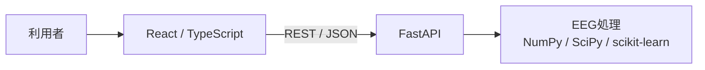
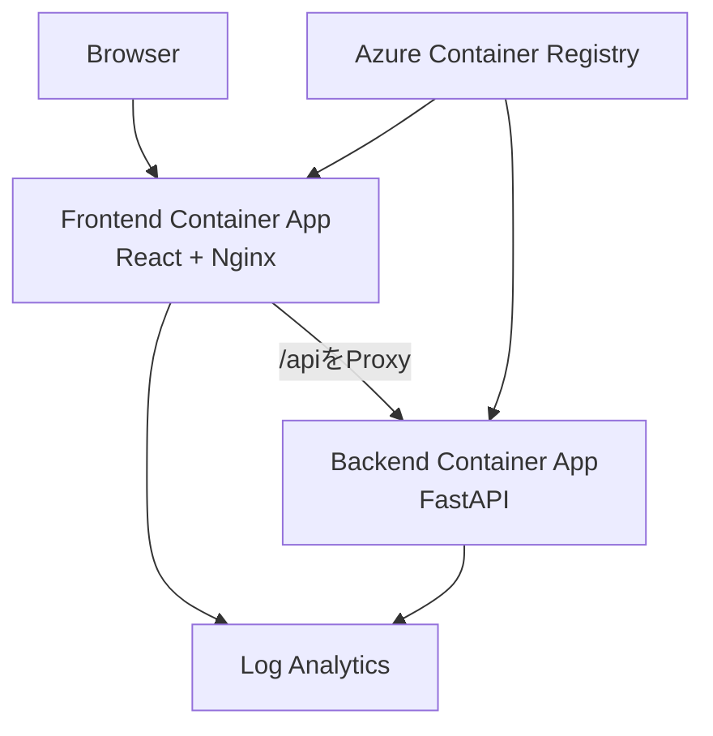

# システム構成

## 1. 全体構成

FrontendとBackendを分離し、REST APIで接続する。EEG計算はすべてBackend内のPythonサービスで実行する。



## 2. ローカル開発構成

`compose.yaml`で2コンテナを起動する。

| Service | 実行内容 | Port | ソース反映 |
|---|---|---:|---|
| `frontend` | Vite開発サーバー | 5173 | `./frontend:/app` |
| `backend` | Uvicorn / FastAPI | 8000 | `./backend:/app` |

```text
Browser → localhost:5173 → Vite
Browser → localhost:5173/api/* → Vite proxy → backend:8000
```

Frontendの`API_BASE_URL`は空文字であり、同一Originの相対URLを使う。Viteは開発時に`/api`をBackendへProxyする。

## 3. Azure構成



| 項目 | Frontend | Backend |
|---|---|---|
| Container App | `ca-eeg-frontend` | `ca-eeg-backend` |
| 外部公開 | あり | なし |
| Port | 80 | 8000 |
| CPU / Memory | 0.25 vCPU / 0.5 GiB | 1 vCPU / 2 GiB |
| Replica | 0～1 | 0～1 |

本番FrontendはViteでBuildした静的ファイルをNginxで配信する。Nginxは`/api/`を内部Backendの`http://ca-eeg-backend`へ中継し、CSVアップロード上限を100 MB、Backend待機時間を240秒としている。BackendはInternetへ直接公開しない。

## 4. Backend内部

| 層 | ファイル | 責務 |
|---|---|---|
| Application | `backend/app/main.py` | FastAPI、GZip、CORS、Router、Health |
| Router | `backend/app/routers/eeg.py` | HTTP受付、CSV変換、Service呼出し |
| Schema | `backend/app/schemas/eeg.py` | Pydantic Request / Response |
| Service | `eeg_filter.py` | デジタルフィルタ |
| Service | `eeg_spectral.py` | PSD、Band Power |
| Service | `eeg_reconstruction.py` | 欠損補間、MLP、評価 |

## 5. Frontend内部

| 層 | 主なファイル | 責務 |
|---|---|---|
| Page | `pages/Dashboard.tsx` | 共有Stateと処理順序 |
| Component | `components/eeg/*` | Upload、波形、Filter、再構築、解析 |
| API | `services/api.ts` | Backend呼出し |
| Type | `types/eeg.ts` | EEG・評価データ型 |

## 6. インフラ管理

TerraformはResource Group、Container Apps Environment、ACR、Frontend/Backend Container Apps、Log Analytics、User Assigned Managed Identity、`AcrPull`権限を管理する。ACRの管理者認証は無効で、Container AppsはManaged IdentityでImageを取得する。

詳細は[08_Azure構成.md](./08_Azure構成.md)を参照する。

## 7. 既知の構成上の制約

Frontendは`GET /health`を呼び出すが、現在のVite・Nginx設定は`/health`をBackendへProxyしていない。このため、画面上のAPI状態表示はBackendの実状態を正しく確認できない。修正時は両環境のProxy対象へ`/health`を追加する。
