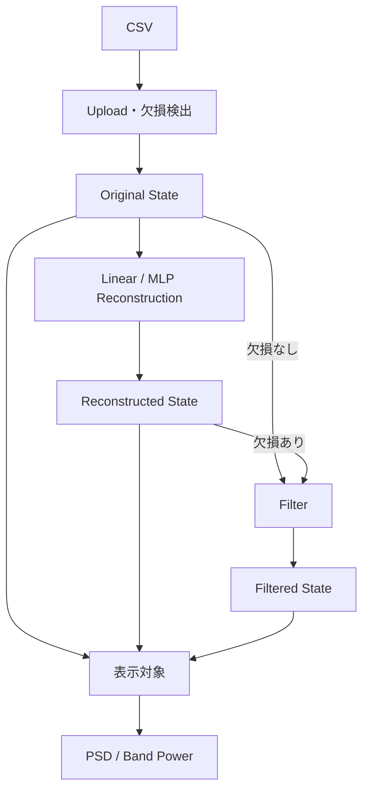

# データフロー

## 1. 共通形式

EEG配列はFrontend・Backendともに `[channel][sample]` を使用する。欠損値はJSONでは`null`、Python配列では`NaN`として扱う。

```text
data[channelIndex][sampleIndex]
```

## 2. 全体フロー



## 3. CSVアップロード

1. `FileUpload`がCSVを`POST /api/eeg/upload`へ送る。
2. Backendが拡張子、空データ、`time`、チャンネル、数値、サンプル数、時刻順序を検証する。
3. `time`以外の各列についてNaNを走査し、チャンネル別の欠損区間を生成する。
4. `[sample][channel]`の表を`[channel][sample]`へ転置して返す。
5. `Dashboard`がOriginalを保存し、以前のReconstructed / Filteredを破棄する。

## 4. 欠損情報

Uploadレスポンスの`missingData`は以下を保持する。

- 欠損の有無
- 全欠損数、全値数、欠損率
- 欠損チャンネル名
- 各チャンネルの欠損数・欠損率
- 各連続欠損区間のSample番号、時刻、長さ

## 5. 再構築

### 線形補間

`POST /api/eeg/reconstruct`を呼び、各チャンネルの有効Sample間を`numpy.interp`で補間する。端の欠損は最寄りの有効値で埋められる。

### MLP補完

`POST /api/eeg/reconstruct-mlp`を呼ぶ。各チャンネルでForward / Backward MLPを学習し、欠損区間の両側から得た予測を位置に応じて重み付き合成する。

成功時は`reconstructedData`を更新し、表示対象を`reconstructed`へ切り替え、以前のFilter結果を破棄する。

## 6. Filter入力

- Originalに欠損がなければOriginalを入力する。
- Originalに欠損があればReconstructedを入力する。
- 再構築前の欠損データにFilterを直接適用しない。

Filter成功時は`filteredData`を保存し、表示対象を`filtered`へ切り替える。

## 7. PSD / Band Power

PSDとBand Powerは、画面で選択中のOriginal / Reconstructed / Filteredのいずれかを入力にする。結果は各Panel内のStateへ保持し、入力信号が変わった場合は再計算する。

## 8. 再構築評価

評価は欠損のないOriginalを使用する。

```text
Original → 人工欠損Mask → Linear / MLPで再構築
         → Mask位置だけ正解と比較
         → RMSE / MAE / Correlation
```

初期値は欠損率10%、連続欠損0.2秒、乱数Seed 42である。MLP学習にはNaNを含むWindowとTargetを使用せず、評価対象の正解値が学習へ混入することを防ぐ。

## 9. 保持範囲

データはブラウザのReact Stateにのみ保持し、Backend、DB、Azure Storageには保存しない。再読込すると消失する。
