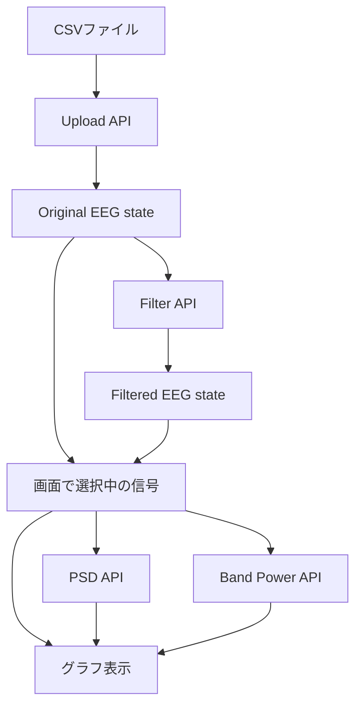
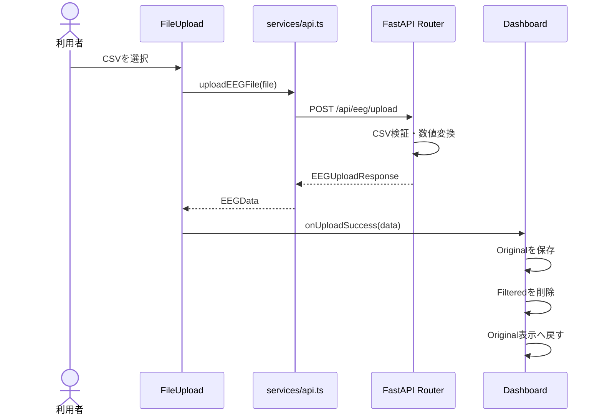
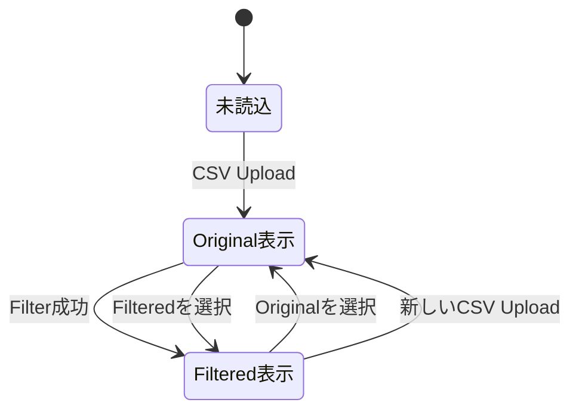
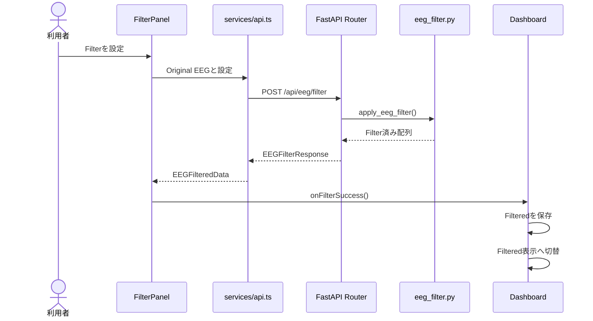
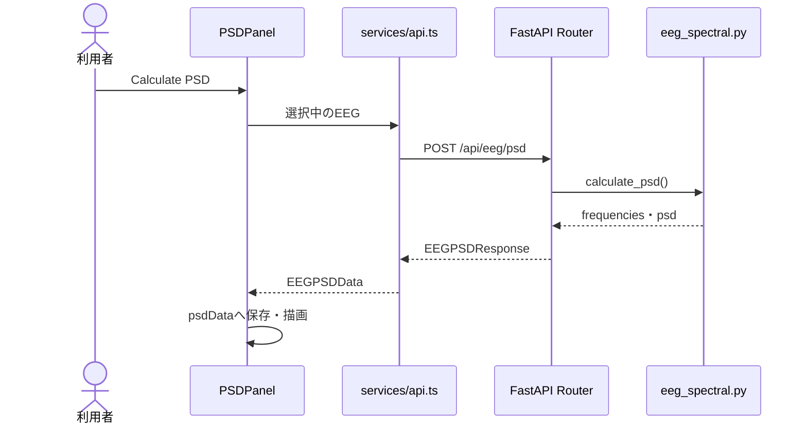
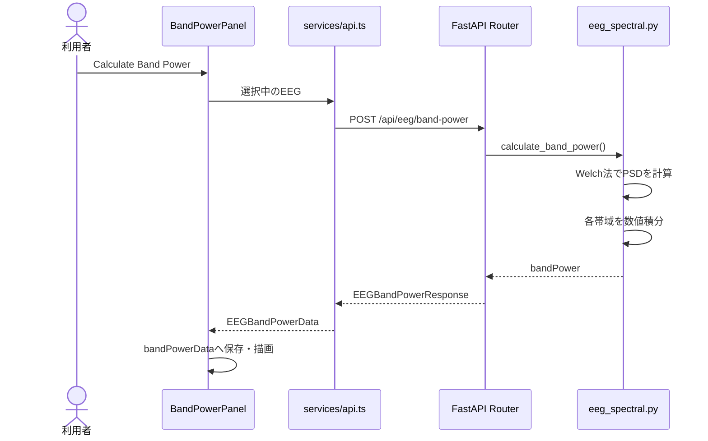
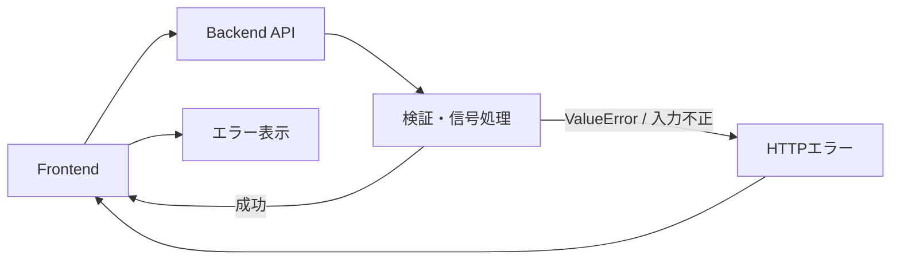

# データフロー

## 目次

- [1. 本文書の目的](#1-本文書の目的)
- [2. データフロー全体](#2-データフロー全体)
- [3. 共通EEGデータ形式](#3-共通eegデータ形式)
  - [3.1 Frontendの型](#31-frontendの型)
  - [3.2 EEG配列の向き](#32-eeg配列の向き)
- [4. CSVアップロード](#4-csvアップロード)
  - [4.1 処理の流れ](#41-処理の流れ)
  - [4.2 Backendでの変換](#42-backendでの変換)
  - [4.3 Frontendのstate更新](#43-frontendのstate更新)
- [5. Original／Filteredの管理](#5-originalfilteredの管理)
- [6. Filter処理](#6-filter処理)
- [7. PSD処理](#7-psd処理)
- [8. Band Power処理](#8-band-power処理)
- [9. 画面表示用データ](#9-画面表示用データ)
- [10. 解析結果のリセット](#10-解析結果のリセット)
- [11. エラー時の流れ](#11-エラー時の流れ)
- [12. データの保持範囲](#12-データの保持範囲)
- [13. 現在のデータフロー上の制約](#13-現在のデータフロー上の制約)

## 1. 本文書の目的

本文書では、CSVファイルがFrontendからBackendへ送信され、EEGデータへ変換された後、Filter、PSDおよびBand Powerの各処理でどのように受け渡されるかを示す。

システムを構成するコンテナとモジュールの関係は[02_システム構成.md](./02_システム構成.md)、各APIの詳細な入出力は[04_API仕様.md](./04_API仕様.md)に記載する。

## 2. データフロー全体



CSVの内容はUpload APIで検証・変換され、Original EEGとしてFrontendへ保存される。FilterはOriginal EEGへ適用し、結果を別のFiltered EEGとして保存する。

PSDとBand Powerには、画面上で選択中のOriginalまたはFiltered EEGを送信する。

## 3. 共通EEGデータ形式

### 3.1 Frontendの型

Upload APIから受け取る基本データは、Frontendで`EEGData`として定義している。

```ts
type EEGData = {
  fileName: string
  samplingRate: number
  duration: number
  channels: string[]
  data: number[][]
}
```

| 項目 | 内容 |
|---|---|
| `fileName` | アップロードしたCSVのファイル名 |
| `samplingRate` | 時刻差分から推定したサンプリング周波数 |
| `duration` | 先頭時刻と末尾時刻の差 |
| `channels` | `time`以外のCSV列名 |
| `data` | チャンネルごとのEEGサンプル |

Backend側では、同じ構造をPydanticモデルで定義する。FrontendのTypeScript型は開発・ビルド時の型確認、BackendのPydanticモデルはAPI実行時の検証を担当する。

### 3.2 EEG配列の向き

CSVをpandasで読み込んだ直後の配列は、行がサンプル、列がチャンネルである。

```text
[sample][channel]
```

例：

```text
[
  [Fp1の0番, Fp2の0番],
  [Fp1の1番, Fp2の1番],
  [Fp1の2番, Fp2の2番]
]
```

Backendは転置して、以下の形式でFrontendへ返す。

```text
[channel][sample]
```

```text
[
  [Fp1の0番, Fp1の1番, Fp1の2番],
  [Fp2の0番, Fp2の1番, Fp2の2番]
]
```

この形式により、`data[channelIndex]`で1チャンネル分の時系列データを取得できる。Backendの信号処理でも、`axis=1`を時間方向として処理する。

## 4. CSVアップロード

### 4.1 処理の流れ



Frontendは選択されたCSVを`FormData`へ格納する。

```ts
const formData = new FormData()
formData.append('file', file)
```

ブラウザ内のReactからBackendへ、`multipart/form-data`として送信する。CSVファイルはFrontendコンテナを経由しない。

### 4.2 Backendでの変換

Backendは以下の順で処理する。

1. 拡張子がCSVであることを確認する。
2. pandasでCSVを読み込む。
3. 空データでないことを確認する。
4. `time`列の存在を確認する。
5. `time`以外の列をEEGチャンネルとする。
6. 時刻とEEG値を数値へ変換する。
7. 欠損値、サンプル数、時刻の増加を確認する。
8. 時刻差分の中央値からサンプリング周波数を算出する。
9. 先頭時刻と末尾時刻の差から記録時間を算出する。
10. EEG配列を`[sample][channel]`から`[channel][sample]`へ転置する。
11. JSONとしてFrontendへ返す。

サンプリング周波数は以下で算出する。

```text
samplingRate = 1 / median(diff(time))
```

記録時間は以下で算出する。

```text
duration = lastTime - firstTime
```

Upload APIのレスポンスには元の`time`配列を含めない。Frontendは、サンプル番号とサンプリング周波数から表示時刻を算出する。

```text
time = sampleIndex / samplingRate
```

### 4.3 Frontendのstate更新

Upload成功後、`Dashboard.tsx`は以下を実行する。

```ts
setEEGData(data)
setFilteredData(null)
setDisplaySource('original')
```

新しいCSVを読み込んだとき、以前のFilteredデータは削除され、表示対象もOriginalへ戻る。これにより、別のCSVから作成したFilteredデータが残ることを防ぐ。

## 5. Original／Filteredの管理

`Dashboard.tsx`は、OriginalとFilteredを別々のstateで保持する。

```text
eegData
→ Upload APIから受け取ったOriginal EEG

filteredData
→ Filter APIから受け取ったFiltered EEG

displaySource
→ 'original' または 'filtered'
```

表示対象は次の条件で決まる。

```ts
let displayData = eegData

if (
  displaySource === 'filtered'
  && filteredData
) {
  displayData = filteredData
}
```

`displayData`はEEG波形、PSDおよびBand Powerへ渡される。



Original EEGはFilter成功時にも上書きされない。

## 6. Filter処理

Filterは、現在画面に表示している信号ではなく、常にOriginal EEGへ適用する。

`Dashboard.tsx`では`FilterPanel`へ`eegData`を渡している。

```tsx
<FilterPanel
  eegData={eegData}
  onFilterSuccess={handleFilterSuccess}
/>
```

処理の流れは以下のとおりである。



OFFになっているFilterは`null`として送信する。

```json
{
  "highpassHz": 0.5,
  "lowpassHz": 40,
  "notchHz": null
}
```

Filter APIのレスポンスは基本EEGデータに、適用設定を追加した形式である。

```ts
type EEGFilteredData = EEGData & {
  highpassHz: number | null
  lowpassHz: number | null
  notchHz: number | null
}
```

Filter成功後は`filteredData`を更新し、`displaySource`を`filtered`へ変更する。再度Filterを実行した場合も、現在のFiltered EEGへ重ねて適用するのではなく、Original EEGから新しいFiltered EEGを作成する。

## 7. PSD処理

PSDには、`displayData`を渡す。

```tsx
<PSDPanel eegData={displayData} />
```

そのため、画面でOriginalを選択している場合はOriginal、Filteredを選択している場合はFilteredのPSDを計算する。



PSDレスポンスの形式は以下である。

```ts
type EEGPSDData = {
  fileName: string
  samplingRate: number
  channels: string[]
  frequencies: number[]
  psd: number[][]
}
```

`frequencies[index]`と`psd[channelIndex][index]`が対応する。

```text
frequencies
[f0, f1, f2, ...]

psd
[
  [Fp1のf0, Fp1のf1, Fp1のf2, ...],
  [Fp2のf0, Fp2のf1, Fp2のf2, ...]
]
```

PSD結果は`PSDPanel`内のstateに保持する。チャンネルを選択すると、再計算せずに対応する配列をグラフへ表示する。

## 8. Band Power処理

Band Powerにも、PSDと同様に`displayData`を渡す。

```tsx
<BandPowerPanel eegData={displayData} />
```



レスポンスは、各帯域にチャンネル数と同じ長さの配列を持つ。

```ts
bandPower: {
  delta: number[]
  theta: number[]
  alpha: number[]
  beta: number[]
  gamma: number[]
}
```

例：

```text
delta[0] → Fp1のDelta Power
delta[1] → Fp2のDelta Power
alpha[0] → Fp1のAlpha Power
```

チャンネルを変更した場合は再計算せず、各帯域配列の同じ`selectedChannelIndex`を棒グラフへ表示する。

## 9. 画面表示用データ

EEG波形は、OriginalまたはFilteredの`displayData`から生成する。

元のEEGデータは保持したまま、現在の10秒間だけを抽出する。

```text
startSample = floor(windowStart × samplingRate)
endSample   = ceil(windowEnd × samplingRate)
```

各チャンネルについて、表示区間の平均値を引いて中心化する。その後、Rechartsへ渡す点数を抑えるため、複数サンプルを区間に分け、各区間の最小値と最大値を表示用として残す。

このダウンサンプリングはグラフ表示専用であり、Frontendが保持する元データやBackendへ送る解析データは削減しない。

時間スライダーを動かすと`startSecond`だけが変化する。この操作はFrontend内で完結し、Backend APIを呼び出さない。

## 10. 解析結果のリセット

PSDPanelとBandPowerPanelは、受け取る`eegData`が変化した場合に以前の結果を削除する。

```ts
useEffect(() => {
  setPSDData(null)
}, [eegData])
```

```ts
useEffect(() => {
  setBandPowerData(null)
}, [eegData])
```

リセットが発生する主な操作は以下のとおりである。

- 新しいCSVをアップロードする
- OriginalからFilteredへ切り替える
- FilteredからOriginalへ切り替える
- Filterを再実行し、新しいFilteredデータを受け取る

これにより、現在表示中のEEGと異なる信号の解析結果が残ることを防ぐ。

## 11. エラー時の流れ



Backendでは、CSV不正や信号処理条件不正を`HTTPException`へ変換して返す。Filter、PSDおよびBand Powerでは、Frontendがレスポンスの`detail`を読み取り、各パネル内のerror stateへ保存する。

Upload APIのFrontend実装は現在エラーをコンソールへ出力するのみで、画面上のエラーメッセージ表示は未実装である。

## 12. データの保持範囲

現在、CSVファイルやEEGデータをデータベース・ファイルストレージへ保存しない。

| データ | 保持場所 | 保持期間 |
|---|---|---|
| Original EEG | `Dashboard`のstate | ページを開いている間 |
| Filtered EEG | `Dashboard`のstate | ページを開いている間 |
| PSD結果 | `PSDPanel`のstate | 対象EEGが変わるまで |
| Band Power結果 | `BandPowerPanel`のstate | 対象EEGが変わるまで |
| CSVファイル名 | Original EEG内 | ページを開いている間 |
| CSVファイル本体 | 永続化しない | Upload API処理中のみ |

ブラウザを再読み込みすると、Frontendのstateは初期化され、保持していたデータと解析結果は消える。

## 13. 現在のデータフロー上の制約

- CSVの元の`time`配列をFrontendへ返していない。
- Frontendは等間隔サンプリングを前提として表示時刻を復元する。
- CSVと解析結果を永続化しない。
- FilterはOriginal EEGに対してのみ適用する。
- Filterを複数回重ねて適用することはできない。
- PSDとBand Powerは独立したAPI呼び出しであり、それぞれの処理内でPSDを計算する。
- Upload失敗時の画面上のエラー表示を実装していない。
- 大きなEEGデータはJSON配列としてFrontendとBackend間を往復する。
- リアルタイムストリーミングには対応していない。
