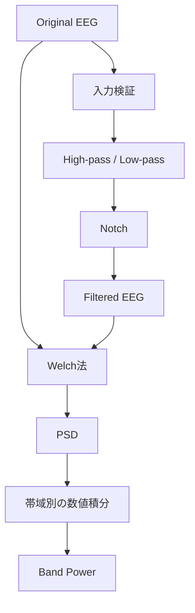
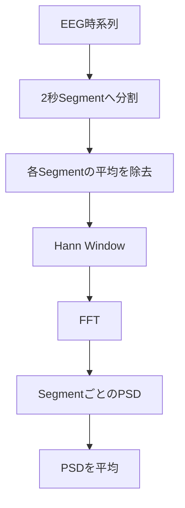

# EEG信号処理

## 目次

- [1. 本文書の目的](#1-本文書の目的)
- [2. 信号処理の全体像](#2-信号処理の全体像)
- [3. サンプリング周波数](#3-サンプリング周波数)
- [4. デジタルフィルタ](#4-デジタルフィルタ)
- [5. Notch Filter](#5-notch-filter)
- [6. Fourier変換とFFT](#6-fourier変換とfft)
- [7. PSD](#7-psd)
- [8. Welch法](#8-welch法)
- [9. Band Power](#9-band-power)
- [10. 入力検証](#10-入力検証)
- [11. 実装上の制約と今後の改善](#11-実装上の制約と今後の改善)

## 1. 本文書の目的

本文書では、EEG Analysis Platformで使用するデジタルフィルタ、Power Spectral Density（PSD）、Welch法およびBand Powerについて、信号処理上の意味と現在のPython実装との対応を説明する。

APIの入出力は[04_API仕様.md](./04_API仕様.md)、FrontendからBackendまでのデータの流れは[03_データフロー.md](./03_データフロー.md)に記載する。

## 2. 信号処理の全体像

本システムは、CSVから読み込んだEEGに対して以下の処理を提供する。



Filter処理は`backend/app/services/eeg_filter.py`、PSDとBand Powerは`backend/app/services/eeg_spectral.py`に実装している。両Serviceとも、EEG配列を以下の向きで受け取る。

```text
[channel][sample]
```

NumPy／SciPyでは`axis=1`を時間方向として処理する。

## 3. サンプリング周波数

### 3.1 サンプリングとは

実際のEEGは時間に対して連続的に変化するアナログ信号である。コンピューターで処理するには、一定時間ごとに値を取得して離散データへ変換する。この操作をサンプリングという。

1秒間に取得するサンプル数がサンプリング周波数`fs`で、単位はHzである。

```text
fs = 250 Hz
→ 1秒間に250サンプル
→ サンプリング間隔は1 / 250 = 0.004秒
```

Upload APIはCSVの`time`列から隣接時刻の差を求め、その中央値を使って`fs`を推定する。

```text
fs = 1 / median(diff(time))
```

中央値を使うことで、一部の時刻差に小さなばらつきがあっても平均値より影響を受けにくくする。ただし、現在の実装は不等間隔サンプリングを等間隔へ補間するものではない。

### 3.2 Nyquist周波数

サンプリング周波数`fs`で正しく表現できる上限周波数をNyquist周波数という。

```math
f_N = \frac{f_s}{2}
```

250 Hzでサンプリングした場合は以下になる。

```text
Nyquist周波数 = 250 / 2 = 125 Hz
```

デジタルフィルタのカットオフ周波数やNotch中心周波数は、0 Hzより大きくNyquist周波数未満でなければならない。本実装もこの条件を検証する。

### 3.3 エイリアシング

Nyquist周波数以上の成分をそのままサンプリングすると、本来とは異なる低い周波数として観測される。これをエイリアシングという。

例えば250 Hzでサンプリングするとき、150 Hzの成分は100 Hzの成分のように折り返して見える可能性がある。サンプリング後にLow-pass Filterをかけても、すでに100 Hzへ化けた成分と本来の100 Hzを区別できない。

そのため実際の計測装置では、A/D変換前にアナログのAnti-aliasing Filterを使用する。本アプリは取得済みCSVを処理するため、計測時のAnti-aliasing処理は担当しない。

## 4. デジタルフィルタ

### 4.1 Filterの目的

EEGには、脳活動以外の低周波ドリフト、筋電、商用電源などの成分が混入する。デジタルフィルタは、必要な周波数帯を残し、不要な周波数成分を抑制するために使用する。

Filterをかけると情報を選択的に削るため、設定値によっては解析対象の脳活動まで減衰させる。したがって、Filter設定は目的に応じて決め、結果と一緒に記録する必要がある。

### 4.2 High-pass Filter

High-pass Filterは、指定周波数より高い成分を通し、低い成分を減衰させる。

```text
例：highpassHz = 0.5
0.5 Hzより十分低い成分 → 減衰
0.5 Hzより十分高い成分 → 通過
```

EEGでは、電極のゆっくりした変動や基線ドリフトを抑える目的で使用する。ただし、カットオフ周波数以下を完全にゼロにする境界ではなく、周波数に応じて徐々に減衰する。

### 4.3 Low-pass Filter

Low-pass Filterは、指定周波数より低い成分を通し、高い成分を減衰させる。

```text
例：lowpassHz = 40
40 Hzより十分低い成分 → 通過
40 Hzより十分高い成分 → 減衰
```

高周波ノイズや、目的によっては筋電成分を抑えるために使用する。40 Hzで切る場合、40 Hz以上に存在するGamma帯域の一部も解析対象から失われる点に注意する。

### 4.4 Band-pass Filter

High-passとLow-passを両方指定した場合は、両者を別々に直列実行するのではなく、1つのBand-pass Filterを設計する。

```python
butter(
    N=4,
    Wn=[highpass_hz, lowpass_hz],
    btype="bandpass",
    fs=sampling_rate,
    output="sos",
)
```

例えば`highpassHz=0.5`、`lowpassHz=40`なら、主に0.5–40 Hzを通過させる。実装は以下の分岐になる。

| 設定 | 実行するFilter |
|---|---|
| High-passとLow-passがON | Band-pass |
| High-passだけON | High-pass |
| Low-passだけON | Low-pass |
| 両方OFF | これらを実行しない |

High-pass周波数はLow-pass周波数より低くなければならない。

### 4.5 Butterworth Filter

本実装はSciPyの`butter()`でButterworth IIR Filterを設計する。Butterworth Filterは通過帯域が最大平坦となり、通過帯域内にRippleを持たないことが特徴である。

急峻さだけを最優先するFilterではないが、通過帯域の振幅特性が滑らかで、一般的な信号処理で広く使用される。

### 4.6 Filter次数

`butter()`の設計次数は`N=4`としている。次数を高くするとカットオフ付近の切り替わりは急になる一方で、数値的不安定性、過渡応答、端点の影響などが増える。

本実装はさらに前向き・逆向きの2回Filterを適用するため、振幅特性としての実効次数は設計次数の2倍相当になる。

```text
設計：4次
前向き処理：4次
逆向き処理：4次
結果の振幅応答：8次相当
```

### 4.7 SOS

Butterworth Filterは`output="sos"`でSecond-Order Sections形式として生成する。高次Filterを1組の係数で直接計算するより、2次Filterを複数段に分けた方が浮動小数点計算で安定しやすい。

```text
4次Filter
→ 2次Section × 2段
```

適用には`scipy.signal.sosfiltfilt()`を使用する。

### 4.8 ゼロ位相フィルタ

通常の因果Filterは、周波数成分を減衰させるだけでなく信号の位相をずらすため、波形のピーク時刻が移動する可能性がある。

本実装は、信号を前向きにFilterした後、時間を反転して逆向きにも同じFilterを適用する。

```text
元信号
→ 前向きFilter
→ 逆向きFilter
→ 位相ずれを相殺した信号
```

Butterworth Filterには`sosfiltfilt()`、Notch Filterには`filtfilt()`を使用する。これにより位相ずれは原理上ゼロになるため、オフライン解析で波形の時間関係を保ちやすい。

一方、逆方向の未来サンプルも使用するためリアルタイム処理には利用できない。リアルタイム化するときは、因果Filterと遅延の扱いを別途設計する必要がある。

また、`filtfilt`系は信号端を補完して処理するため、短すぎるデータでは実行できない場合があり、先頭と末尾付近には端点影響が残り得る。

## 5. Notch Filter

### 5.1 商用電源ノイズ

Notch Filterは、特定周波数付近だけを狭く減衰させる。EEGでは商用電源から混入する50 Hzまたは60 HzのLine Noiseを抑えるために使用される。

```text
東日本の商用電源：主に50 Hz
西日本の商用電源：主に60 Hz
```

本実装では中心周波数を`notchHz`として利用者が選択する。Low-pass／High-pass／Band-passの後にNotchを適用する。

### 5.2 Q値

Notch Filterは`scipy.signal.iirnotch()`で設計し、Quality Factorを`Q=30`に固定している。

```math
Q = \frac{f_0}{BW}
```

- `f0`：Notch中心周波数
- `BW`：-3 dB帯域幅

したがって、おおよその帯域幅は以下になる。

```text
50 Hz Notch：50 / 30 ≈ 1.67 Hz
60 Hz Notch：60 / 30 = 2.0 Hz
```

Qを高くすると除去範囲が狭くなり、低くすると広くなる。現在はUIからQ値を変更できない。

## 6. Fourier変換とFFT

### 6.1 時間領域と周波数領域

EEG波形は通常、横軸を時間、縦軸を振幅として表示する。これを時間領域表現という。

Fourier変換を使うと、信号を異なる周波数の正弦波と余弦波の組み合わせとして分解し、「どの周波数がどれだけ含まれるか」を表現できる。これが周波数領域表現である。

### 6.2 DFT

コンピューターが扱う有限個のサンプルにはDiscrete Fourier Transform（DFT）を使用する。

```math
X[k] = \sum_{n=0}^{N-1} x[n]e^{-j2\pi kn/N}
```

- `x[n]`：n番目の時間サンプル
- `X[k]`：k番目の周波数成分を表す複素数
- `N`：サンプル数

`X[k]`の絶対値はその周波数成分の大きさ、複素数の角度は位相を表す。

### 6.3 FFT

Fast Fourier Transform（FFT）はDFTとは別の変換ではなく、DFTを高速に計算するアルゴリズムである。

単純なDFTの計算量が概ね`O(N²)`であるのに対し、FFTは`O(N log N)`まで削減できる。SciPyの`welch()`は各区間についてFFTを使い、PSDを計算する。

### 6.4 周波数ビンと分解能

`N`サンプルをサンプリング周波数`fs`でFFTしたとき、隣り合う周波数点の間隔は概ね以下になる。

```math
\Delta f = \frac{f_s}{N} = \frac{1}{T}
```

`T`は解析区間の秒数である。250 Hzで2秒分の500サンプルを使う場合は以下になる。

```text
Δf = 250 / 500 = 0.5 Hz
```

解析区間を長くすると周波数分解能は高くなるが、時間変化を細かく追いにくくなる。区間を短くすると逆の関係になる。

### 6.5 有限区間とSpectral Leakage

DFTは、切り出した有限区間が無限に繰り返されると仮定して計算する。区間の先頭と末尾の値がつながらないと、繰り返し境界に急な段差が生じる。

急な段差は広い周波数成分を含むため、本来1つの周波数に集中するはずのEnergyが周辺の周波数ビンへ漏れる。これをSpectral Leakageという。

```text
区間末尾  2.0 ┐
              │ 繰り返し境界の段差
区間先頭 -1.0 ┘
```

窓関数は区間の両端を小さくし、この不連続を弱める。ただし信号そのものへ重みを付けるため、主ピークが横へ広がるなどのTrade-offがある。

## 7. PSD

### 7.1 Power

信号処理におけるPowerは、振幅の二乗に対応する量である。振幅が2倍になるとPowerは概ね4倍になる。

周波数成分の複素振幅`X`に対しては、`|X|²`がPowerの基礎になる。ただし実際には、サンプル数、サンプリング周波数、窓関数などに応じた正規化が必要である。

### 7.2 Power Spectral Density

PSDは、信号のPowerが周波数軸上にどのような密度で分布しているかを表す。

単なるFFT振幅は「各周波数の振幅」を表すが、PSDは振幅を二乗し、周波数幅当たりのPowerとして正規化した値である。

```text
FFT       → 周波数ごとの複素振幅
|FFT|     → 振幅Spectrum
|FFT|²    → Powerの基礎
PSD       → 1 Hz当たりに正規化したPower
```

本実装は`welch(..., scaling="density")`を指定してPSDを返す。

### 7.3 PSDの単位

入力EEGの単位が`U`ならPSDの単位は以下になる。

```text
U² / Hz
```

CSVの値がµVなら`µV²/Hz`、Vなら`V²/Hz`となる。現在のCSVには振幅単位のMetadataがないため、アプリは数値をそのまま処理し、画面上で単位を保証していない。

PSDを周波数方向に積分すると`/Hz`が打ち消され、Band Powerの単位は`U²`になる。

## 8. Welch法

### 8.1 Welch法の目的

1つの区間だけでPeriodogramを求めると、推定値のばらつきが大きくなりやすい。Welch法は信号を重なり合う複数区間へ分割し、各区間のPSDを平均することで推定のばらつきを抑える。

処理の概略は以下である。



### 8.2 Segment長

本実装は1 Segmentを2秒分に設定する。

```python
segment_samples = int(sampling_rate * 2)
nperseg = min(segment_samples, sample_count)
```

250 Hzなら500サンプルとなり、周波数点の間隔は約0.5 Hzになる。データ全体が2秒未満の場合は、存在する全サンプルを1 Segmentとして使用する。

2秒は、EEGの0.5–45 Hz付近を表示するための周波数分解能と、複数Segmentを確保するためのバランスとして採用している。ただし研究目的に基づいて最適化した値ではなく、現在のPrototype設定である。

### 8.3 Detrend

`detrend="constant"`を指定しているため、各SegmentからそのSegmentの平均値を引いてからPSDを計算する。

```text
x_detrended[n] = x[n] - mean(x)
```

これによりDC成分、すなわち0 Hz付近の大きなOffsetを抑える。時間とともに傾くLinear Trendまで除去する設定ではない。

### 8.4 Window関数

SciPyの`welch()`は`window`を省略した場合、既定のHann Windowを使用する。Hann WindowはSegment中央を大きく、両端を0に近づける。

```math
w[n] = 0.5 - 0.5\cos\left(\frac{2\pi n}{N-1}\right)
```

各Segmentに`x[n]w[n]`を適用することで、繰り返し境界の段差を抑え、Spectral Leakageを減らす。

### 8.5 Overlap

本実装はSegment長の50%をOverlapさせる。

```python
noverlap = nperseg // 2
```

2秒Segmentなら1秒ずつ開始位置をずらす。

```text
Segment 1：0–2秒
Segment 2：1–3秒
Segment 3：2–4秒
```

Hann Windowでは端の重みが小さいため、Overlapしないと境界付近の情報が各Segmentで弱く扱われる。50% Overlapにより、あるSegmentの端にあるデータを隣のSegmentでは中央付近として再利用できる。

Overlapを増やすとSegment数は増えるが、隣接Segment同士の類似性と計算量も増える。

### 8.6 PSD平均

各Segmentで窓関数、FFT、Power化、正規化を行い、そのPSDを平均する。

```math
\hat{P}_{xx}(f) = \frac{1}{K}\sum_{k=1}^{K}P_k(f)
```

`K`はSegment数、`Pk(f)`はk番目のSegmentから求めたPSDである。これにより単一FFTより滑らかで、ばらつきの小さいSpectrumを得る。

### 8.7 現在のSciPy設定

```python
frequencies, psd = welch(
    eeg_array,
    fs=sampling_rate,
    nperseg=nperseg,
    noverlap=noverlap,
    axis=1,
    detrend="constant",
    scaling="density",
)
```

| 引数 | 設定 | 意味 |
|---|---|---|
| `fs` | CSVから推定した値 | サンプリング周波数 |
| `nperseg` | 最大2秒分 | Segment長 |
| `noverlap` | Segmentの50% | 重複サンプル数 |
| `axis` | `1` | 時間方向 |
| `detrend` | `constant` | Segment平均を除去 |
| `scaling` | `density` | PSDとして正規化 |
| `window` | 省略 | SciPy既定のHann Window |

## 9. Band Power

### 9.1 周波数帯域

本実装は以下の固定帯域を使用する。

| Band | 範囲 | 一般的な名称 |
|---|---:|---|
| Delta | 0.5 Hz以上4 Hz未満 | δ帯域 |
| Theta | 4 Hz以上8 Hz未満 | θ帯域 |
| Alpha | 8 Hz以上13 Hz未満 | α帯域 |
| Beta | 13 Hz以上30 Hz未満 | β帯域 |
| Gamma | 30 Hz以上45 Hz未満 | γ帯域 |

帯域境界は研究分野や目的によって異なる場合がある。上表は現在の実装定義であり、普遍的に唯一の定義ではない。

### 9.2 PSDの帯域積分

Band Powerは、対象周波数帯に含まれるPSDを周波数方向に積分した値である。

```math
P_{band} = \int_{f_{low}}^{f_{high}} PSD(f)\,df
```

したがって、単にPSDの値を足すだけでなく、周波数点の間隔も含めて面積を求める。周波数間隔が一定なら「PSDを足して周波数間隔を掛ける」ことに相当する。

```text
PSDの縦軸：U²/Hz
周波数幅：Hz
Band Power：U²
```

### 9.3 台形積分

PSDは離散的な周波数点で得られるため、SciPyの`trapezoid()`で数値積分する。隣接する2点間を直線で結び、台形の面積として加算する。

```math
P \approx \sum_{i=0}^{M-2}
\frac{PSD_i + PSD_{i+1}}{2}
(f_{i+1}-f_i)
```

実装では全チャンネルを同時に、`axis=1`の周波数方向へ積分する。

```python
power = trapezoid(
    band_psd,
    band_frequencies,
    axis=1,
)
```

各帯域に周波数点が2点未満しかない場合、台形を作れないため`ValueError`を返す。このため、低いサンプリング周波数や極端に短いデータではBand Powerを計算できない場合がある。

### 9.4 Absolute PowerとRelative Power

現在返しているのは、各帯域のPSDをそのまま積分したAbsolute Band Powerである。

Relative Band Powerは、対象帯域のPowerを全対象周波数帯のPowerなどで割った比率である。

```math
RelativePower_{band} =
\frac{Power_{band}}{Power_{total}}
```

Relative Powerは個人差や電極インピーダンス等による全体振幅差を小さくできる場合があるが、分母となる周波数範囲の定義が必要である。現在は未実装である。

## 10. 入力検証

Filter、PSDおよびBand Powerでは、計算前に以下を確認する。

| 検証 | 条件 |
|---|---|
| サンプリング周波数 | 0より大きい |
| EEGデータ | 空でない |
| 配列次元 | 2次元 `[channel][sample]` |
| チャンネル数 | 1以上 |
| サンプル数 | 2以上 |
| EEG値 | NaN、正負のInfinityを含まない |
| Filter周波数 | 0より大きくNyquist周波数未満 |
| High-passとLow-pass | `highpassHz < lowpassHz` |

検証に失敗するとServiceが`ValueError`を発生させ、Routerが`400 Bad Request`へ変換する。

## 11. 実装上の制約と今後の改善

- Filter設定はPrototypeの固定仕様であり、Filter次数やQ値をUIから変更できない。
- `filtfilt`系を使用するためオフライン処理専用で、リアルタイム因果Filterではない。
- 短い信号では`filtfilt`のPadding長を満たせず、Filterが失敗する場合がある。
- Filter端点付近にはPadding方法による影響が残る可能性がある。
- CSVのサンプリング間隔のばらつきを検証・補間していない。
- PSDは2秒Segment・50% Overlap・Hann Windowに固定している。
- Band Powerの帯域境界は固定で、利用者ごとのIndividual Alpha Frequency等には対応しない。
- Absolute Band Powerのみ実装し、Relative Powerや対数変換は未実装である。
- Artifact除去、Re-reference、Baseline補正、ICA等の前処理は未実装である。
- CSVの振幅単位を保持しないため、PSDとBand Powerの物理単位を画面上で確定できない。
- Filter後の解析結果を研究用途に使用する場合は、設定値、収録条件、電極、Reference、単位を別途記録する必要がある。
