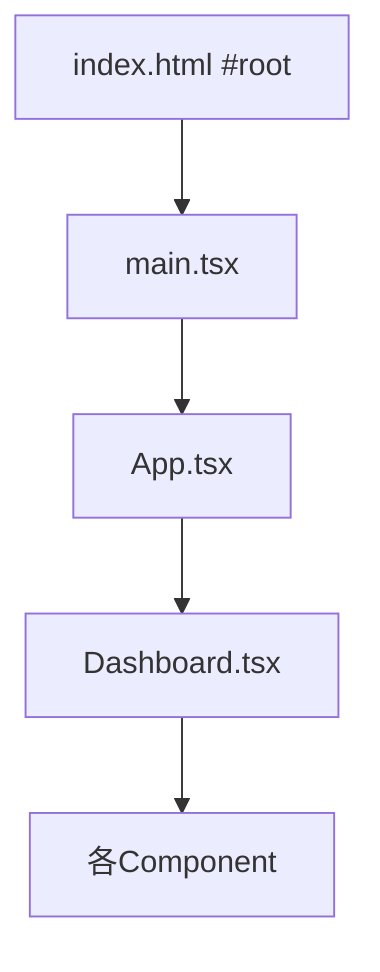
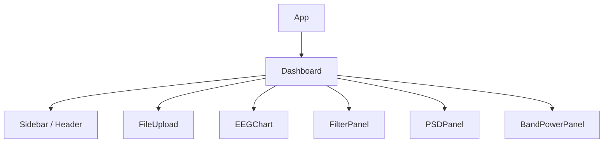
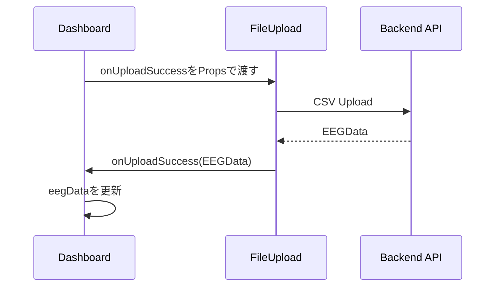

# フロントエンド設計

## 目次

- [1. 本文書の目的](#1-本文書の目的)
- [2. 使用技術](#2-使用技術)
- [3. 起動と描画の流れ](#3-起動と描画の流れ)
- [4. コンポーネント構成](#4-コンポーネント構成)
- [5. DashboardのState管理](#5-dashboardのstate管理)
- [6. PropsとCallback](#6-propsとcallback)
- [7. API通信](#7-api通信)
- [8. 各コンポーネントの責務](#8-各コンポーネントの責務)
- [9. 波形表示の設計](#9-波形表示の設計)
- [10. 再レンダーとuseEffect](#10-再レンダーとuseeffect)
- [11. TypeScript型](#11-typescript型)
- [12. エラー・Loading状態](#12-エラーloading状態)
- [13. 現在の制約と改善候補](#13-現在の制約と改善候補)

## 1. 本文書の目的

本文書では、EEG Analysis PlatformのFrontendについて、Reactコンポーネント構成、State管理、Propsによるデータ受け渡し、API通信およびグラフ描画の設計を説明する。

FrontendとBackend間のデータの流れは[03_データフロー.md](./03_データフロー.md)、APIの入出力は[04_API仕様.md](./04_API仕様.md)に記載する。

## 2. 使用技術

| 技術 | 用途 |
|---|---|
| React | UIをコンポーネントとして構築 |
| TypeScript | Props、State、APIデータの型定義 |
| Vite | 開発Server・Build環境 |
| Recharts | EEG波形、PSD、Band Powerの描画 |
| Lucide React | 画面内Icon |
| CSS | Layout、Color、Responsive表示 |
| Fetch API | Backend REST APIとの通信 |

FrontendコンテナはVite開発Serverを`5173`番Portで起動し、Reactコードをブラウザへ配信する。React自体はコンテナ内ではなく、配信後に利用者のブラウザ内で実行される。

## 3. 起動と描画の流れ

FrontendのEntry Pointは`frontend/src/main.tsx`である。



`main.tsx`はHTMLの`root`要素へ`App`を描画する。

```tsx
createRoot(
  document.getElementById('root')!
).render(
  <StrictMode>
    <App />
  </StrictMode>
)
```

`App.tsx`は現在、RoutingやGlobal Stateを持たず、`Dashboard`をそのまま表示する。

```tsx
function App() {
  return <Dashboard />
}
```

`StrictMode`は開発時に潜在的な問題を検出するためのReact機能である。開発環境では、副作用の問題を見つける目的でComponentの描画やEffectが追加実行されるように見える場合がある。

## 4. コンポーネント構成



| Component | 主な責務 |
|---|---|
| `Dashboard` | Page全体、共有State、Component間の連携 |
| `Sidebar` | NavigationとVersion表示 |
| `Header` | Title、API状態、Upload Button |
| `FileUpload` | CSV選択とUpload API呼び出し |
| `EEGChart` | Original／Filtered波形の表示 |
| `FilterPanel` | Filter設定とFilter API呼び出し |
| `PSDPanel` | PSD計算、Channel選択、Line Chart |
| `BandPowerPanel` | Band Power計算、Channel選択、Bar Chart |

`Reconstruction`と`AI Analysis`は現在Componentへ分離されておらず、`Dashboard.tsx`内にComing Soonの静的UIとして記述している。

## 5. DashboardのState管理

複数Componentから利用するEEGデータは、共通の親Componentである`Dashboard`が保持する。

### 5.1 共有State

| State | 型 | 初期値 | 内容 |
|---|---|---|---|
| `eegData` | `EEGData \| null` | `null` | Upload済みOriginal EEG |
| `filteredData` | `EEGFilteredData \| null` | `null` | 最新のFilter結果 |
| `displaySource` | `'original' \| 'filtered'` | `'original'` | 現在の表示対象 |

表示および解析に使用する`displayData`は、既存Stateから描画のたびに決める派生値であり、独立したStateではない。

```ts
let displayData: EEGData | null = eegData

if (
  displaySource === 'filtered'
  && filteredData
) {
  displayData = filteredData
}
```

同じ情報を別Stateとして重複保持しないため、Original／Filteredと表示対象の不整合を起こしにくい。

### 5.2 Upload成功時

```ts
setEEGData(data)
setFilteredData(null)
setDisplaySource('original')
```

新しいCSVを読み込むと、以前のCSVから作成したFiltered EEGを削除し、Original表示へ戻す。

### 5.3 Filter成功時

```ts
setFilteredData(data)
setDisplaySource('filtered')
```

Original EEGは変更せず、結果を`filteredData`へ保存する。これにより利用者はOriginalとFilteredを切り替えて比較できる。

### 5.4 Stateの所有範囲

全Componentで必要な情報をすべて`Dashboard`へ集めるのではなく、共有が必要なStateだけを上位へ置く。

| State例 | 所有Component | 理由 |
|---|---|---|
| Original／Filtered EEG | `Dashboard` | 複数のPanelが使用する |
| Filter設定 | `FilterPanel` | Filter UI内だけで使用する |
| PSD結果 | `PSDPanel` | PSD表示内だけで使用する |
| Band Power結果 | `BandPowerPanel` | Band Power表示内だけで使用する |
| 波形開始秒 | `EEGChart` | 波形Scroll内だけで使用する |
| API Online | `Header` | Header表示内だけで使用する |

## 6. PropsとCallback

Reactでは親から子へPropsでデータを渡す。子が親のStateを変更する必要がある場合は、親がCallback関数をPropsとして渡す。



### 6.1 FileUpload

```ts
type FileUploadProps = {
  onUploadSuccess: (data: EEGData) => void
}
```

`FileUpload`は`Dashboard`の`setEEGData`を直接知らない。Upload成功時にCallbackを実行することで、親がState更新方法を決める。

### 6.2 FilterPanel

```ts
type FilterPanelProps = {
  eegData: EEGData | null
  onFilterSuccess: (
    data: EEGFilteredData
  ) => void
}
```

`eegData`には常にOriginal EEGを渡す。Filter成功結果はCallbackで`Dashboard`へ返す。

### 6.3 表示・解析Component

```tsx
<EEGChart eegData={displayData} />
<PSDPanel eegData={displayData} />
<BandPowerPanel eegData={displayData} />
```

これらには現在選択中のOriginalまたはFilteredを渡すため、Component自身は信号種別を判定する必要がない。

## 7. API通信

Backend通信は`frontend/src/services/api.ts`へ集約する。UI ComponentはURLや`fetch()`の詳細を持たず、目的別関数を呼び出す。

| 関数 | API | 呼び出すComponent |
|---|---|---|
| `uploadEEGFile()` | `POST /api/eeg/upload` | `FileUpload` |
| `filterEEGData()` | `POST /api/eeg/filter` | `FilterPanel` |
| `calculatePSD()` | `POST /api/eeg/psd` | `PSDPanel` |
| `calculateBandPower()` | `POST /api/eeg/band-power` | `BandPowerPanel` |
| `checkAPIHealth()` | `GET /health` | `Header` |

Uploadは`FormData`、解析APIはJSONを送信する。

```ts
headers: {
  'Content-Type': 'application/json'
},
body: JSON.stringify(requestBody)
```

`fetch()`はHTTP 400や500でもPromiseを自動的にはRejectしないため、`response.ok`を明示的に確認する。

```ts
if (!response.ok) {
  const errorData = await response.json()
  throw new Error(errorData.detail)
}
```

通信失敗、CORS失敗などResponse自体を取得できない場合は`fetch()`がRejectし、各Componentの`catch`へ進む。

## 8. 各コンポーネントの責務

### 8.1 Header

初回Mount時に`checkAPIHealth()`を1回実行し、`isOnline`を更新する。

```ts
useEffect(() => {
  checkHealth()
}, [])
```

Upload Buttonを押すと、`Dashboard`から渡されたCallbackが非表示の`eeg-file-input`をIDで取得し、`.click()`を実行する。

### 8.2 FileUpload

`input type="file"`から最初の1ファイルを取得し、Upload APIを呼ぶ。`accept=".csv"`でFile Picker上の対象をCSVへ絞るが、これはFrontend上の補助であり、Backendでも拡張子を再検証する。

選択ファイル名は`fileName` Stateへ保存する。Upload失敗時は現在`console.error()`だけを実行し、画面内のError表示を持たない。

### 8.3 FilterPanel

FilterのON／OFF、周波数、実行中状態、ErrorをLocal Stateとして持つ。

| State | 初期値 |
|---|---:|
| `highpassEnabled` | `false` |
| `lowpassEnabled` | `false` |
| `notchEnabled` | `false` |
| `highpassHz` | `0.5` |
| `lowpassHz` | `40` |
| `notchHz` | `50` |

OFFのFilterは設定値を保持したままBackendへ`null`を送る。入力欄の`min=0.1`はブラウザUI上の制約だが、最終的なNyquist条件等はBackendが検証する。

### 8.4 PSDPanel

Calculate Button押下時に選択中EEG全体をBackendへ送り、結果を`psdData`へ保持する。Channel変更時はAPIを再実行せず、すでに受け取った2次元配列から対象Channelを選ぶ。

```text
psdData.psd[selectedChannelIndex][frequencyIndex]
```

Peak Frequencyは0 Hzを除外したうえで、表示Channel内の最大PSDを持つ周波数としてFrontendで求める。

### 8.5 BandPowerPanel

PSDPanelと同様に、計算結果全体を`bandPowerData`へ保持し、Channel変更時は配列の添字だけを切り替える。

Dominant Bandは、選択中ChannelのDelta～Gammaのうち最大値を持つBandとしてFrontendで求める。

### 8.6 Sidebar

現在のNavigationは静的表示であり、React Router等による画面遷移を実装していない。CSV AnalysisだけをActive表示し、Realtime AnalysisとAI ModelsはComing Soonとして無効表示する。

## 9. 波形表示の設計

### 9.1 10秒Window

`EEGChart`は全データを一度に描画せず、最大10秒を表示する。

```ts
const WINDOW_SECONDS = 10
```

Sliderの`startSecond`から表示サンプル範囲を算出する。

```text
startSample = floor(windowStart × samplingRate)
endSample   = ceil(windowEnd × samplingRate)
```

Sliderは0.1秒Stepで動き、この操作はFrontend内だけで完結する。

### 9.2 表示区間の中心化

各Channelについて現在表示中の値の平均を引く。

```text
centeredValue = value - visibleWindowMean
```

これはグラフを0付近へ配置して比較しやすくする表示処理である。保持中のEEGデータやBackendへ送る解析データは変更しない。また、表示Windowを動かすと平均値も変わる。

### 9.3 Min／Maxダウンサンプリング

1Channel当たり約300 Bucketへ分け、各Bucketの最小値と最大値を時系列順に残す。

```ts
const DISPLAY_BUCKETS = 300
```

単純に一定間隔の点だけを抜き出す方式では、抜き出し位置の間に存在する瞬目などのPeakを失う場合がある。Min／Max方式では各Bucketの両端振幅を残すため、Peakを比較的保持しながらRechartsへ渡す点数を減らせる。

最大で概ね600点／Channelになるが、同一Indexが最小・最大の場合は1点だけになる。

### 9.4 Y軸

表示中の全Channelから絶対振幅の最大値を求め、10%のMarginを加えた共通範囲を使う。

```text
yLimit = max(maxAmplitude × 1.1, 1)
Y domain = [-yLimit, yLimit]
```

全Channelが同じScaleになるため振幅を比較できる一方、1つの大きなArtifactがあると他のChannelが小さく見える。

### 9.5 Recharts

各Channelを独立した`LineChart`として縦に並べる。Animationを無効にし、時間Slider操作時の描画負荷を抑える。12色を順番に割り当て、13 Channel目以降は色を再利用する。

## 10. 再レンダーとuseEffect

ReactはStateまたはPropsが変わると、対象Componentを再評価して画面を更新する。

### 10.1 EEGChart

```ts
useEffect(() => {
  setStartSecond(0)
}, [eegData])
```

新しいCSV、Original／Filtered切替、Filter再実行などで`eegData`参照が変わると、表示開始位置を0秒へ戻す。

### 10.2 PSDPanel

```ts
useEffect(() => {
  setPSDData(null)
  setSelectedChannelIndex(0)
  setError(null)
}, [eegData])
```

### 10.3 BandPowerPanel

```ts
useEffect(() => {
  setBandPowerData(null)
  setSelectedChannelIndex(0)
  setError(null)
}, [eegData])
```

解析対象が変わるたびに古い結果を削除するため、Originalの結果をFilteredの結果として表示することを防ぐ。ただし、信号を切り替えて元へ戻った場合も結果は復元されず、再計算が必要になる。

## 11. TypeScript型

APIデータ型は`frontend/src/types/eeg.ts`へ集約する。

```ts
type EEGData = {
  fileName: string
  samplingRate: number
  duration: number
  channels: string[]
  data: number[][]
}
```

Filtered型はIntersection Typeを利用し、基本EEG項目を再定義せずFilter設定だけを追加する。

```ts
type EEGFilteredData = EEGData & {
  highpassHz: number | null
  lowpassHz: number | null
  notchHz: number | null
}
```

TypeScript型はCompile時の確認に使われ、Backendから受信したJSONを実行時に検証するものではない。現在は`response.json()`の結果へ型注釈を付けているだけなので、Backend Responseが型と異なってもブラウザ上で自動検出されない。

## 12. エラー・Loading状態

Filter、PSD、Band Powerはそれぞれ独立した`isFiltering`／`isCalculating`と`error`を持つ。

```text
Button押下
→ Errorを削除
→ Loadingをtrue
→ API呼び出し
→ 成功時は結果を保存
→ 失敗時はErrorを保存
→ finallyでLoadingをfalse
```

Loading中はButtonを無効化し、二重送信を防ぐ。EEG未読込時も実行Buttonを無効化する。

現在、Page全体を覆うLoading表示や共通Toastはなく、各Panel内で状態を管理する。API処理を同時に実行することは可能である。

## 13. 現在の制約と改善候補

- `API_BASE_URL`が`http://localhost:8000`へ固定され、環境変数化していない。
- Upload Errorを画面上へ表示せず、Backendの具体的な`detail`も破棄する。
- API ResponseをZod等で実行時検証していない。
- API Health Checkは初回の1回だけで、定期監視や再接続を行わない。
- React Routerを使用せず、Sidebarの画面遷移は未実装である。
- 状態をMemoryだけに保持し、Reloadすると全データが消える。
- 大容量EEGをFrontend StateとJSONへそのまま保持する。
- 波形の表示用計算をRenderのたびに実行し、`useMemo`やWeb Workerを使用していない。
- Channel数が多い場合、ChannelごとにRechartsを生成するため描画負荷が増える。
- 波形Tooltipは`µV`と表示するが、CSVの振幅単位を検証・保持していない。
- PSDとBand PowerのY軸に物理単位を明示していない。
- OriginalとFilteredごとの解析結果Cacheを持たず、切替時に結果を削除する。
- ReconstructionとAI Analysisは静的なPlaceholderである。
