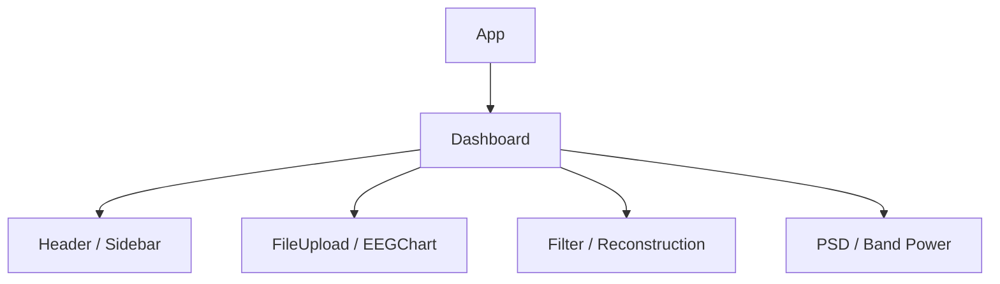

# フロントエンド設計

## 1. 概要

FrontendはReactとTypeScriptで実装する。Viteは開発サーバーとBuildを担当し、本番ではBuild成果物をNginxが配信する。グラフにはRecharts、アイコンにはLucide Reactを使用する。

## 2. コンポーネント

| Component | 責務 |
|---|---|
| `Dashboard` | Original / Reconstructed / Filteredの共有Stateと処理順序 |
| `Header` | タイトル、API状態、Upload操作 |
| `Sidebar` | ナビゲーション表示 |
| `FileUpload` | CSV選択とUpload API |
| `EEGChart` | 波形、チャンネル表示、10秒範囲移動、色設定 |
| `FilterPanel` | Filter設定と実行 |
| `ReconstructionPanel` | 欠損情報、Linear / MLP補完、評価起動 |
| `ReconstructionEvaluationModal` | Linear / MLPのRMSE・MAE・相関比較 |
| `MissingDataPanel` | 欠損件数、率、区間表示 |
| `PSDPanel` | PSD計算と折れ線表示 |
| `BandPowerPanel` | 5帯域Power計算と棒グラフ表示 |

## 3. Dashboard State

| State | 型 | 用途 |
|---|---|---|
| `eegData` | `EEGData \| null` | Original EEG |
| `reconstructedData` | `EEGReconstructedData \| null` | 最新の再構築結果 |
| `filteredData` | `EEGFilteredData \| null` | 最新のFilter結果 |
| `displaySource` | `original \| reconstructed \| filtered` | 表示・解析対象 |

### Upload成功

Originalを更新し、以前のReconstructed / Filteredを削除してOriginal表示へ戻す。

### Reconstruction成功

Reconstructedを保存し、以前のFilteredを削除してReconstructed表示へ切り替える。

### Filter成功

Filteredを保存し、Filtered表示へ切り替える。

## 4. Filter入力制御

Originalに欠損がある場合はReconstructedをFilterへ渡し、欠損がない場合はOriginalを渡す。これによりNaNを含む配列がSciPy Filterへ直接送られることを防ぐ。

## 5. API通信

`frontend/src/services/api.ts`へ通信処理を集約する。

| 関数 | API |
|---|---|
| `uploadEEGFile` | Upload |
| `reconstructEEGData` | Linear Reconstruction |
| `reconstructEEGDataWithMLP` | MLP Reconstruction |
| `evaluateLinearReconstruction` | Linear評価 |
| `evaluateMLPReconstruction` | MLP評価 |
| `filterEEGData` | Filter |
| `calculatePSD` | PSD |
| `calculateBandPower` | Band Power |
| `checkAPIHealth` | Health Check |

`API_BASE_URL`は空文字で、相対URLを使用する。`/api`はローカルではVite、本番ではNginxがBackendへProxyするため、ブラウザからBackendの内部URLを直接参照しない。

## 6. 型

`types/eeg.ts`は次の主要型を定義する。

- `EEGData`
- `EEGMissingDataInfo` / `EEGMissingSegment`
- `EEGReconstructedData`
- `EEGReconstructionEvaluation`
- `EEGFilteredData`
- `EEGPSDData`
- `EEGBandPowerData`

## 7. 波形・解析表示

- EEG波形は10秒単位の表示範囲を選択できる。
- Original / Reconstructed / Filteredを切り替えられる。
- PSDとBand Powerは現在選択中の信号を入力にする。
- PSDとBand PowerはPanelごとに結果とチャンネル選択を保持する。

## 8. エラーとLoading

各API呼出し中は操作を抑止し、失敗時はBackendの`detail`を可能な範囲で利用者へ表示する。MLP再構築はデータごとに学習するため、Linearより長い待ち時間を想定する。

## 9. 現在の制約

- Global State管理LibraryやRouterは使用していない。
- 解析結果はブラウザStateのみで、Reload時に消える。
- AI Analysis欄のEEG分類機能は未実装。
- 本番APIはNginx Proxy前提である。
- `checkAPIHealth`は`/health`を呼ぶが、現在のVite・Nginxには`/health`のProxy設定がないため、BackendのHealth Checkとして正しく機能しない。
