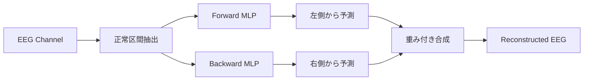
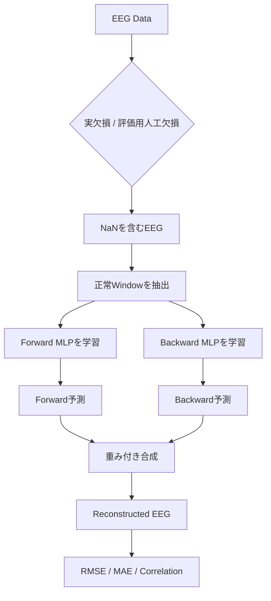

# AI Reconstruction設計

## 目次

- [1. 本文書の目的](#1-本文書の目的)
- [2. AI Reconstructionの概要](#2-ai-reconstructionの概要)
- [3. 処理フロー](#3-処理フロー)
- [4. 使用モデル](#4-使用モデル)
- [5. 学習データの生成](#5-学習データの生成)
- [6. Forward / Backwardモデル](#6-forward--backwardモデル)
- [7. 欠損区間の再構築](#7-欠損区間の再構築)
- [8. 評価方法](#8-評価方法)
- [9. Data Leakage対策](#9-data-leakage対策)
- [10. Frontend / APIとの接続](#10-frontend--apiとの接続)
- [11. 現在の評価結果](#11-現在の評価結果)
- [12. 特性・制約](#12-特性制約)
- [13. 今後の改善候補](#13-今後の改善候補)
- [14. 実装ファイル](#14-実装ファイル)

## 1. 本文書の目的

本文書では、EEG Analysis Platformに実装したAI Reconstruction機能について、モデル構成、学習方法、欠損区間の推定方法、評価方法、および現在の制約を説明する。

本機能は、EEGデータ中に欠損したSampleが存在する場合に、正常区間から時系列パターンを自己学習し、欠損値を推定して再構築することを目的とする。

単純な線形補間（Linear Interpolation）だけでなく、MLPによる時系列予測を用いることで、周期性や局所的な時間構造を持つEEG信号に対して、より元波形に近い再構築を目指す。

---

## 2. AI Reconstructionの概要

現在のAI Reconstructionでは、各EEG Channelごとに独立した時系列MLPを学習する。

学習時には、正常な連続Sampleから以下の教師データを生成する。

```text
過去16 Samples
      ↓
     MLP
      ↓
次の1 Sampleを予測
```

欠損区間を再構築する際は、時系列を通常方向から学習したForward Modelと、時系列を逆順にして学習したBackward Modelの2つを使用する。



現在のモデルはChannel間の関係を使用せず、各Channel内部の時系列構造のみを利用する。

---

## 3. 処理フロー

AI Reconstructionの処理は以下の流れで行う。



実際の欠損データに対しては、再構築後のEEGをFrontendへ返す。

評価時には、欠損のない既知データへ人工的な欠損を作成し、再構築値と元の正解値を比較する。

---

## 4. 使用モデル

### 4.1 モデル種類

使用しているモデルは、scikit-learnの`MLPRegressor`である。

MLPはMulti-Layer Perceptronの略で、全結合層から構成されるFeed Forward Neural Networkである。

現在はCNN、RNN、LSTM、Transformerなどは使用していない。

### 4.2 モデル構成

現在の設定は以下の通り。

```python
MLPRegressor(
    hidden_layer_sizes=(64, 32),
    activation="tanh",
    solver="adam",
    max_iter=1000,
    early_stopping=True,
    random_state=42,
)
```

概念上のNetwork構造は以下である。

```text
16 Samples
    ↓
StandardScaler
    ↓
Input Layer
    ↓
Hidden Layer: 64
    ↓
Hidden Layer: 32
    ↓
Output: 1 Sample
```

### 4.3 StandardScaler

MLPの前段には`StandardScaler`を使用する。

EEG値の平均と標準偏差を用いてScaleを揃えることで、MLPが学習しやすい入力へ変換する。

概念的には以下の標準化を行う。

```math
z = \frac{x - \mu}{\sigma}
```

### 4.4 活性化関数

Hidden Layerの活性化関数には`tanh`を使用する。

`tanh`は出力を概ね-1～1へ変換する非線形関数であり、時系列波形の正負両方向の変化を扱える。

### 4.5 Optimizer

重みの更新には`adam`を使用する。

Adamは勾配情報を利用して各Parameterを更新する最適化手法である。

### 4.6 Early Stopping

`early_stopping=True`としているため、Validation性能が改善しなくなった場合は`max_iter=1000`へ到達する前に学習を終了できる。

---

## 5. 学習データの生成

### 5.1 自己回帰学習

本モデルでは、別途教師ラベル付きDatasetを用意しない。

アップロードされたEEG自身から、正常区間を切り出して教師データを生成する。

例えば以下の時系列が存在するとする。

```text
x1 x2 x3 ... x16 x17 x18 ...
```

学習データは以下のように生成される。

```text
x1  ～ x16 → x17
x2  ～ x17 → x18
x3  ～ x18 → x19
...
```

このように、直前16 Samplesから次の1 Sampleを予測する自己回帰モデルとして学習する。

### 5.2 Channel単位の学習

MLPはChannelごとに個別学習する。

```text
Fp1 → Fp1用MLP
Fp2 → Fp2用MLP
F3  → F3用MLP
...
O2  → O2用MLP
```

したがって現状では、例えばFp1の欠損をC3やO1の情報から補うことは行わない。

### 5.3 学習Window数

各Channelで最低100個の有効なTraining Windowを要求する。

正常Windowが100個未満の場合、AI Reconstructionはエラーとする。

---

## 6. Forward / Backwardモデル

### 6.1 Forward Model

Forward Modelは通常の時間方向で学習する。

```text
過去                           未来
x x x x x x x x | ? ? ? ? ? |
                 ↑
           左側から予測
```

正常な過去16 Samplesから、その次のSampleを推定する。

### 6.2 Backward Model

Backward ModelではChannelデータを逆順にする。

```python
channel_data[::-1]
```

逆方向の時系列に対して同じMLP学習を行うことで、元の時間軸では未来側から過去方向へ予測できる。

```text
過去                           未来
| ? ? ? ? ? | x x x x x x x x
              ↑
         右側から予測
```

### 6.3 双方向予測の目的

Forward予測だけでは、長い欠損区間において予測誤差が次の入力へ連鎖しやすい。

Backward Modelを併用することで、欠損区間の左右両方の正常データを利用できる。

---

## 7. 欠損区間の再構築

### 7.1 自己回帰的な連続予測

50 Samplesの欠損がある場合、Forward Modelは1 Sampleずつ順番に予測する。

```text
正常16 Samples
      ↓
欠損1点目を予測
      ↓
予測値を次の入力へ含める
      ↓
欠損2点目を予測
      ↓
...
```

このため、長い欠損では初期の予測誤差が後段へ蓄積する可能性がある。

Backward Modelでも同様の処理を逆方向から行う。

### 7.2 Forward / Backwardの合成

両方向の予測が利用できる場合は、欠損区間内の位置によって重みを変更して合成する。

Forward側の重みは以下で計算する。

```python
forward_weight = (
    (gap_length - offset)
    / (gap_length + 1)
)
```

概念的には以下のようになる。

```text
欠損区間

左端                         右端

Forward
██████████▓▓▓▒▒░░

Backward
░░▒▒▓▓▓██████████
```

左端ではForward予測を強く利用し、右端ではBackward予測を強く利用する。

中央付近では両者を近い比率で合成する。

---

## 8. 評価方法

### 8.1 人工欠損

評価時は、欠損のない既知EEGから人工的にSampleを隠す。

現在Frontendから送信する標準設定は以下。

```text
maskRate = 0.10
gapDurationSeconds = 0.20
randomSeed = 42
```

250 Hzのデータの場合、

```text
0.20 sec × 250 Hz = 50 Samples
```

となるため、1つの連続欠損区間は基本的に50 Samplesとなる。

`maskRate=0.10`のため、全体として約10%の既知Sampleを隠して評価する。

### 8.2 Linearとの公平な比較

Linear ReconstructionとAI Reconstructionでは、同じ`maskRate`、`gapDurationSeconds`、`randomSeed`を使用する。

同一の人工欠損位置に対して2つの手法を評価することで、条件差による比較の偏りを避ける。

### 8.3 RMSE

Root Mean Squared Error。

```math
RMSE = \sqrt{\frac{1}{N}\sum_{i=1}^{N}(\hat{y_i} - y_i)^2}
```

大きな誤差を強く評価する。

小さいほど良い。

### 8.4 MAE

Mean Absolute Error。

```math
MAE = \frac{1}{N}\sum_{i=1}^{N}|\hat{y_i} - y_i|
```

平均的な絶対誤差を示す。

小さいほど良い。

### 8.5 Correlation

元の欠損値と再構築値のPearson相関係数を計算する。

```text
 1.0  : 非常に似た波形
 0.7  : 強い正の相関
 0.4  : 中程度の正の相関
 0.0  : 線形な関係がほぼない
-1.0  : 逆方向の波形
```

RMSE / MAEは振幅誤差、Correlationは主に波形形状の一致度を見るため、複数指標を合わせて評価する。

---

## 9. Data Leakage対策

評価時には、正解値をMLPへ見せないことが重要である。

人工欠損を生成した後、評価対象Sampleを`NaN`へ置換する。

```python
masked = original.copy()
masked[mask] = np.nan
```

学習Window生成時には、入力WindowおよびTargetがすべて有限値であることを確認する。

```python
np.all(np.isfinite(window))
and np.isfinite(target)
```

したがって、人工的に隠したSampleを含むWindowや、隠したSample自身をTargetとするWindowはTraining Dataへ使用しない。

```text
Original EEG
    ↓
人工欠損位置を決定
    ↓
正解値をNaN化
    ↓
NaNを含まない正常Windowだけで学習
    ↓
欠損値を予測
    ↓
最後に元の正解値と比較
```

この構造により、評価対象の正解値を見てから予測するData Leakageを防止する。

---

## 10. Frontend / APIとの接続

### 10.1 AI Reconstruction

実欠損をAIで補完するAPI。

```text
POST /api/eeg/reconstruct-mlp
```

処理結果として、再構築後のEEG配列と再構築Sample数を返す。

Frontendでは`Run AI Reconstruction`から呼び出す。

### 10.2 AI評価

人工欠損を作成してAI精度を評価するAPI。

```text
POST /api/eeg/reconstruction/evaluate-mlp
```

Frontendでは`Evaluate AI`から呼び出す。

### 10.3 Linear評価

比較Baseline。

```text
POST /api/eeg/reconstruction/evaluate-linear
```

### 10.4 再構築後の後段処理

実欠損を`Run AI Reconstruction`で補完した場合、再構築後のEEGはSignal Sourceとして保持される。

そのため、以下の処理へ続けて入力できる。

```text
Missing EEG
    ↓
AI Reconstruction
    ↓
Reconstructed EEG
    ↓
Filter
    ↓
Filtered EEG
    ↓
PSD / Band Power
```

`Evaluate AI`は評価指標のみを返す処理であり、評価用に人工欠損したデータをReconstructed EEGとして画面状態へ保存するものではない。

---

## 11. 現在の評価結果

250 Hz、30秒、8 Channelの合成EEGを用いて、`maskRate=10%`、`gapDurationSeconds=0.2 sec`で評価した。

### 11.1 Easy

規則的な周期信号を中心とした予測しやすいデータ。

| Method | RMSE | MAE | Correlation |
|---|---:|---:|---:|
| Linear | 12.0144 | 9.7395 | -0.0174 |
| AI (MLP) | **1.1729** | **0.9471** | **0.9911** |

### 11.2 Medium

Alpha / Theta / Beta、振幅変動、低周波Drift、Noiseを含むEEG-likeデータ。

| Method | RMSE | MAE | Correlation |
|---|---:|---:|---:|
| Linear | 8.3744 | 6.6274 | 0.0852 |
| AI (MLP) | **4.3900** | **3.4800** | **0.7171** |

### 11.3 Hard

非定常なBurstおよび一過性変化を含むデータ。

| Method | RMSE | MAE | Correlation |
|---|---:|---:|---:|
| Linear | 7.2300 | 5.5364 | 0.1847 |
| AI (MLP) | **4.3765** | **3.3314** | **0.6689** |

### 11.4 Very Hard

周波数変化、Baseline変化、予測困難なSharp Transientを含むデータ。

| Method | RMSE | MAE | Correlation |
|---|---:|---:|---:|
| Linear | 7.1581 | 5.6004 | 0.2050 |
| AI (MLP) | **5.2872** | **3.8656** | **0.4393** |

### 11.5 評価結果の解釈

AIのCorrelationは以下のように低下した。

```text
Easy       : 0.9911
Medium     : 0.7171
Hard       : 0.6689
Very Hard  : 0.4393
```

周期性・局所的な時系列構造が強い信号ほど高精度に再構築できる。

一方、欠損区間内だけで突然発生するSharp Transientなど、前後の情報から原理的に推測しにくい事象では性能が低下する。

---

## 12. 特性・制約

### 12.1 強み

- 学習済み外部Modelを必要としない
- 入力EEG自身から正常パターンを自己学習できる
- Linear Interpolationでは復元できない周期構造を推定できる
- Forward / Backward両方向のContextを利用できる
- Channelごとに異なる波形特性を個別学習できる

### 12.2 制約

#### Channel間情報を使用しない

現在はChannelごとに独立して学習するため、空間的なEEG Channel間相関を利用していない。

#### 長い欠損で誤差が蓄積する

欠損区間内部を自己回帰的に予測するため、長時間の連続欠損では誤差が蓄積しやすい。

#### 完全に未知のイベントは復元できない

欠損区間内だけに存在するSpikeやArtifactなどは、前後のEEGから情報を得られないため正確な復元は原理的に困難である。

#### Datasetごとに再学習する

現在はアップロードしたEEGごとにMLPをその場でTrainingするため、データ量やChannel数によって実行時間が増える。

#### 研究・Prototype用途

現在の結果は合成EEGを用いたPrototype評価であり、臨床用途や診断用途の性能を保証するものではない。

---

## 13. 今後の改善候補

### 13.1 欠損時間別評価

現在の0.2秒欠損に加えて、以下を評価する。

```text
0.02 sec
0.05 sec
0.10 sec
0.20 sec
0.50 sec
1.00 sec
```

欠損時間とRMSE / MAE / Correlationの関係を確認し、実用上の限界を評価する。

### 13.2 Channel間情報の利用

現在：

```text
Fp1過去値 → Fp1予測
```

将来：

```text
Fp1 + Fp2 + F3 + F4 + C3 + C4 ...
                    ↓
                 Fp1予測
```

のように複数Channelを入力へ利用することで、空間相関を利用した補完が可能になる。

### 13.3 時系列専用Model

MLP以外に以下のModelを比較候補とする。

- 1D-CNN
- RNN
- LSTM
- GRU
- Temporal Convolutional Network
- Transformer
- Autoencoder

ただし、Prototype段階ではModelを複雑化する前に、現在のMLPの性能・処理時間・限界を定量化することを優先する。

### 13.4 Reconstruction波形の比較表示

以下を同じ時間軸上で比較できるUIを追加する。

```text
Original
Missing
Linear
AI Reconstruction
```

評価値だけでなく、実際に波形のどこをどのように復元したかを視覚的に確認できるようにする。

---

## 14. 実装ファイル

AI Reconstructionに関連する主な実装は以下。

### Backend

```text
backend/app/services/eeg_reconstruction.py
```

主な処理：

- Linear Reconstruction
- 人工欠損Mask生成
- MLP Training
- Forward / Backward Reconstruction
- Linear評価
- MLP評価
- RMSE / MAE / Correlation計算

```text
backend/app/routers/eeg.py
```

主なAPI：

```text
POST /api/eeg/reconstruct
POST /api/eeg/reconstruct-mlp
POST /api/eeg/reconstruction/evaluate-linear
POST /api/eeg/reconstruction/evaluate-mlp
```

### Frontend

```text
frontend/src/components/eeg/ReconstructionPanel.tsx
```

主な機能：

- Linear / AI Reconstruction実行
- Linear / AI評価実行
- RMSE / MAE / Correlation表示

```text
frontend/src/services/api.ts
```

FrontendからBackend Reconstruction APIへのHTTP Requestを実装する。

```text
frontend/src/pages/Dashboard.tsx
```

Original / Reconstructed / Filtered EEGの表示Sourceを管理し、Reconstruction後のデータをFilter、PSD、Band Powerへ接続する。
