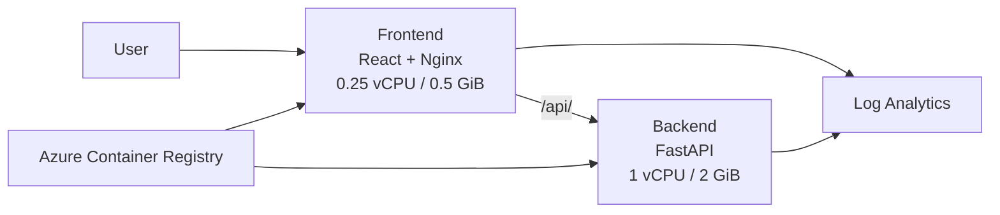

# Azure構成メモ

## 構成概要

EEG Analysis Platform は Azure Container Apps 上で Frontend と Backend を分けて動かしている。



## Frontend

* Azure Container Apps
* React + TypeScript
* Nginx
* 外部公開あり
* Port 80
* 0.25 vCPU / 0.5 GiB
* Backendへの通信をNginxで中継

FrontendからBackendへは以下で通信する。

```text
http://ca-eeg-backend
```

Backendは外部公開していない。

## Backend

* Azure Container Apps
* Python + FastAPI
* EEG解析処理を担当
* 外部公開なし
* Port 8000
* 1 vCPU / 2 GiB

主な処理:

* CSV読み込み
* EEG波形解析
* PSD解析
* 線形補間
* AI Reconstruction
* RMSE / MAE / 相関評価

## Azure Container Registry

Docker ImageはAzure Container Registryに保存する。

```text
eeganalysisacr
```

Frontend:

```text
eeg-frontend:<tag>
```

Backend:

```text
eeg-backend:<tag>
```

Container AppsはACRからDocker Imageを取得して起動する。

## Managed Identity

Container AppsからACRへアクセスするためにManaged Identityを利用する。

```text
id-eeg-container-apps
```

ACRに対して `AcrPull` 権限を付与している。

そのためACRのユーザー名やパスワードをコードに持つ必要がない。

## Log Analytics

Container AppsのログはLog Analyticsへ送信する。

```text
log-eeg-analysis
```

Azure PortalからContainerの起動状態やエラーログを確認できる。

## Terraform

AzureリソースはTerraformで管理する。

主に以下を管理している。

* Container Apps
* CPU / Memory
* ACR
* Managed Identity
* Log Analytics
* Ingress
* Docker Image Tag

Azure設定を変更するときは基本的に、

```bash
terraform plan
terraform apply
```

を使用する。

## Scale設定

Frontend / Backendともに、

```text
min replicas = 0
max replicas = 1
```

としている。

アクセスがない場合は0台まで停止するため、開発用途ではコストを抑えられる。

初回アクセス時にはCold Startが発生する可能性がある。

## 現在の構成

```text
Internet
   ↓
Frontend Container App
   ↓
Backend Container App
```

Backendを直接Internetへ公開せず、Frontend経由のみでアクセスする構成としている。

Docker ImageはACRで管理し、AzureリソースはTerraformで管理する。
